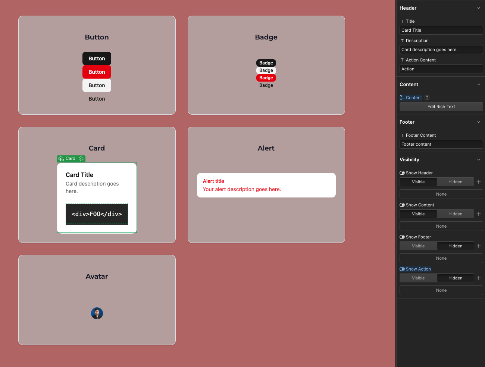

# Shadcn/ui Components for Webflow

[]()
[]()
[]()
[]()
[]()

A comprehensive collection of base [shadcn/ui](https://ui.shadcn.com/) components adapted for Webflow Code Components. These components can be dropped into any Webflow site and configured visually through the Webflow Designer.



## Available Components

### Layout & Navigation
- **Card** - Flexible content container with consistent styling

### Data Display
- **Avatar** - User profile images with fallback support
- **Badge** - Small status indicators and labels
- **Alert** - Important messages and notifications

### Form Elements
- **Button** - Primary and secondary action buttons
- **Input** - Text input fields with validation states

## Getting Started

### Installation

```bash
npm install
```

### Development

To start the development server and preview components:

```bash
npm run dev
```

Visit `http://localhost:3000` to see the component showcase and ensure everything loads correctly.

### Share to Webflow

To make these components available in your Webflow workspace:

```bash
npx webflow library share
```

This will create a code library containing the exposed shadcn/ui components in your designated Webflow workspace.

---

## Project Structure

### Core Components
- `components/ui/*.tsx` - Original shadcn/ui components
- `components/ui/*.webflow.tsx` - Webflow Code Component definitions

---

## How It Works

Each shadcn/ui component has been adapted for Webflow:

1. **Base Component**: The original shadcn/ui component (e.g., `button.tsx`) provides the core functionality
2. **Webflow Wrapper**: A corresponding `.webflow.tsx` file exposes the component to Webflow with appropriate props that map Webflow component props to React props
3. **Visual Configuration**: Designers can configure component behavior through the Webflow Designer settings panel
4. **Consistent Styling**: All components use the shadcn/ui design system with Tailwind CSS classes

## Usage in Webflow

1. **Install Library**: Add the shared component library to your Webflow site. See the [quick start guide](https://developers.webflow.com/code-components/introduction/quick-start#before-you-start) to ensure your Webflow site meets prerequisites
2. **Drag & Drop**: Use components from the Components panel
3. **Configure Props**: Customize behavior through the Settings panel
5. **Compose Components**: Combine individual components to create complex UI patterns
